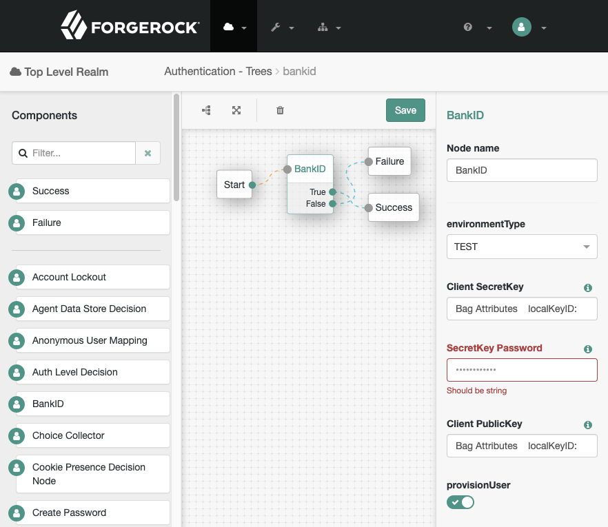

# README

This README explains how to compile and deploy BankID authentication node.

Module was tested with Access Manager 6.5.1.

## Directory structure

* src/main/java - contains all the java sources
* src/main/resources - extra files used to enable new authentication node

## How to deploy
### Develop

[How to implement](https://backstage.forgerock.com/docs/am/6.5/auth-nodes/)

### compile

It is a `maven` project so simply run `mvn install` from the **openam-auth-node-bankid** directory.
You may need to configure settings.xml as per [How do I access the ForgeRock protected Maven repositories?](https://backstage.forgerock.com/knowledge/kb/article/a74096897) article.   

### deploy

Copy the packaged jar file into Access Manager lib directory

```
cp target/openam-auth-node-bankid-1.0.jar <TOMCAT_WEBAPPS_DIR>/openam/WEB-INF/lib/
```

Restart Access Manager to pick up the node.


## How to use

Configuration of the node is pretty easy, all that needs to be set is:
* _Environment_ choose one of TEST, PROD

### Example tree

 

 
